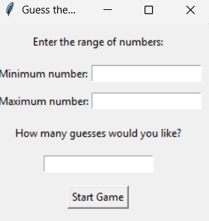

# Guess the Number Game

## 📌 Overview
A simple Python-based "Guess the Number" game where the system generates a random number, and the player has to guess it within a given range and number of attempts. The game provides hints like "higher" or "lower" and whether the number is even or odd.

## ✨ Features
- ✅ **The player selects the range of numbers (min and max).
- ✅ **The player selects the maximum number of attempts.
- ✅ **After each guess, the system gives feedback: "higher", "lower", "even", or "odd".
- ✅ **After the player guesses the correct number, a message is displayed, and the game ends.
- ✅ **The player can choose to play again or quit after finishing a game.
- ✅ **Lightweight GUI** with Tkinter
- ✅ **Standalone executable (.exe) option**

## 🛠️ Installation
To run this game, you need Python installed on your machine.

1. **Clone the repository**:
   ```sh
   git clone https://github.com/LiorDaichman/Guess-Number-Game.git
   cd Guess-Number-Game
   ```
2. **Install dependencies**:
   ```sh
   pip install pyinstaller
   ```
3. **Run the exe file**:
   ```sh
   GuessNumberGame.exe
   ```

## 🚀 How I Creating an Executable (.exe)
If you want to run the program without Python installed, you can convert it to an executable file using **PyInstaller**:

```sh
pip install pyinstaller
pyinstaller --onefile --windowed GuessNumberGame.py
```
This will create a standalone `.exe` file inside the `dist/` folder.

## 📝 License
This project is licensed under the **MIT License**.

## 📩 Contact
For any questions or suggestions, reach out via **liordaichman@gmail.com** or open an issue on GitHub.

## 📷 Screenshot


